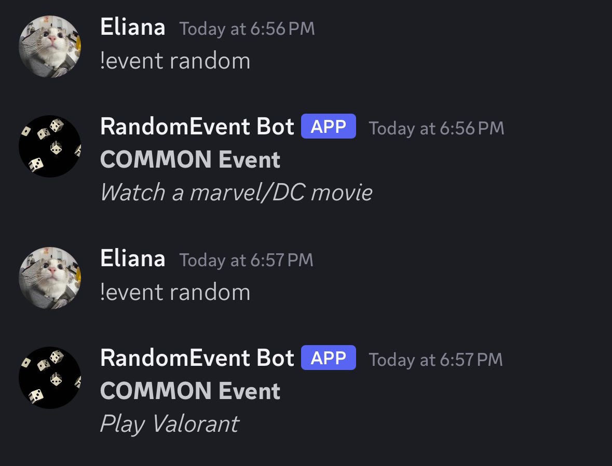

Last year I developed a bot for Discord with Python, the bot was designed to automatically generate different activities in our server. This project introduced me to real world Application Programming Interfaces, also known as APIs, and gave me experience with Python and making bots for discord. 

My main contribution to the bot was designing a randomized event selection system. To make the randomizing a bit more interesting I used a rarity system by adding an extra attribute to the objects. I used the random.choices() function within python's library and weighted the probability based on the rarity. To add the bot to our server we used a Python wrapper called discord.py, through this library we were able to use commands by sending a message that said "!event random" in the server. The bot would then reply with the send() function within the API. 

A problem I encountered after implementing the bot was my friends using the command in rapid succession. We had to make another iteration of RandomEvent Bot that added a cooldown to make sure that the same user could not use the command more than 5 times within 5 minutes. We implemented this by using the commands.cooldown() decorator within discord.py.
